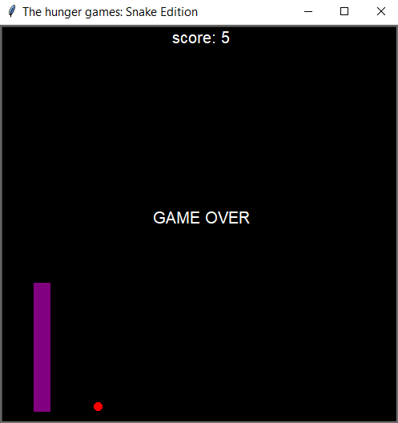

# The Hunger Games: Snake Edition

A simple Snake game implemented in Python using the Turtle module.

## How to Play

1. Clone the repository.
2. Run the main Python file (`main.py`) to start the game.
3. Use the arrow keys to control the snake: Up, Down, Left, Right.

## Gameplay

## Scoreboard class
- Displays scoreboard on top-left side of the screen
- increase_score: Increases score if snake eats the point
- gameover: Displays Game Over if snakes touches its body or the border

## Snake class
- create_snake: Creates snake body
- add_snake_body: Sets color, shape and adds new segments
- extend: Extends the length of the snake(calls add_snake_body) by adding new segment at specfied position
- move: Updates position of snake's body segment based on the position of segment in front of each other
- up: Moves snake up
- left: Moves snake left
- down: Moves snake down
- right: moves snake right

## Food class
- change_food_location: randomly positions the points (food) when eaten by snake
